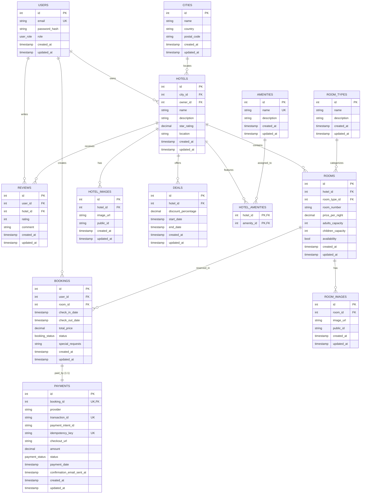

# Hotel Booking & Reservation API

[](https://dotnet.microsoft.com/)
[](https://docs.microsoft.com/en-us/dotnet/csharp/)
[](https://www.postgresql.org/)
[](https://www.docker.com/)
[](https://github.com/a7mad1112/hotel-booking)
[]()
[](https://github.com/a7mad1112/hotel-booking-frontend)
[](https://trello.com/b/edL3w4KO/hotel-booking-system-development-plan)

A production-ready, feature-rich **Hotel Booking and Reservation RESTful API** engineered with **.NET 8**, **Clean Architecture**, and **PostgreSQL**. The system provides end-to-end management of hotel inventories, multi-criteria search with dynamic query composition, room reservation workflows, pluggable payment gateway integration with Stripe webhooks, automated PDF invoice generation, and transactional email notifications.

> 🔗 **Related Project Links & Resources**:
> - 🌐 **Frontend Repository**: [a7mad1112/hotel-booking-frontend](https://github.com/a7mad1112/hotel-booking-frontend)
> - 📋 **Development Board & Plan**: [Trello Development Plan](https://trello.com/b/edL3w4KO/hotel-booking-system-development-plan)
> - 🗄️ **Interactive Database Schema (ERD)**: [dbdiagram.io Schema](https://dbdiagram.io/d/hotel-booking-6aab4010af7c3b0bd1fcf6f2)

---

## Table of Contents

- [Project Links](#project-links)
- [Architectural Design](#architectural-design)
  - [Clean Architecture](#clean-architecture)
  - [Vertical Slice Architecture (Application Layer)](#vertical-slice-architecture-application-layer)
- [Design Patterns Applied](#design-patterns-applied)
- [Technology Stack & Justification](#technology-stack--justification)
- [Database Schema & ERD](#database-schema--erd)
  - [Interactive Schema Diagram](#interactive-schema-diagram)
  - [Entity Relationship Diagram (Mermaid)](#entity-relationship-diagram-mermaid)
  - [Schema Overview & Table Descriptions](#schema-overview--table-descriptions)
- [Key Features](#key-features)
- [Environment Variables (.env)](#environment-variables-env)
- [Getting Started & Local Setup](#getting-started--local-setup)
  - [Prerequisites](#prerequisites)
  - [Option A: Running with Docker Compose (Recommended)](#option-a-running-with-docker-compose-recommended)
  - [Option B: Running Locally with .NET CLI](#option-b-running-locally-with-net-cli)
- [API Documentation & Swagger](#api-documentation--swagger)
- [Testing & Testcontainers](#testing--testcontainers)
- [Project Structure](#project-structure)

---

## Project Links

| Resource | Description | Link |
| :--- | :--- | :--- |
| **Frontend Application** | React / Next.js Client application for the Hotel Booking system | [hotel-booking-frontend Repository](https://github.com/a7mad1112/hotel-booking-frontend) |
| **Development Plan & Roadmap** | Project planning, backlog, and sprint progress tracking board | [Trello Project Board](https://trello.com/b/edL3w4KO/hotel-booking-system-development-plan) |
| **Database Schema & ERD** | Interactive visual model of the 13 PostgreSQL tables and relationships | [dbdiagram.io Schema](https://dbdiagram.io/d/hotel-booking-6aab4010af7c3b0bd1fcf6f2) |

---

## Architectural Design

The project is structured according to **Clean Architecture** (Onion Architecture), combined with **Vertical Slice** organization within the application layer.

```
   ┌────────────────────────────────────────────────────────┐
   │                  HotelBooking.API                      │  Presentation Layer
   │       (Controllers, Middleware, Filters, Program.cs)   │  (ASP.NET Core 8 Web API)
   └───────────────────────────┬────────────────────────────┘
                               │ references
   ┌───────────────────────────▼────────────────────────────┐
   │             HotelBooking.Infrastructure                │  Infrastructure Layer
   │      (EF Core, PostgreSQL, Cloudinary, Stripe, Mail)    │  (External Services & I/O)
   └───────────────────────────┬────────────────────────────┘
                               │ references
   ┌───────────────────────────▼────────────────────────────┐
   │              HotelBooking.Application                  │  Application Layer
   │    (Vertical Slices, Features, DTOs, Pricing/Payment)   │  (Business Use-Cases)
   └───────────────────────────┬────────────────────────────┘
                               │ references
   ┌───────────────────────────▼────────────────────────────┐
   │                HotelBooking.Domain                     │  Domain Layer
   │         (Entities, Enums, Common Base Types)           │  (Enterprise Core)
   └────────────────────────────────────────────────────────┘
```

### Clean Architecture
- **Inward Dependency Rule**: Core business domain logic (`Domain`) has zero external dependencies. The `Application` layer defines interfaces and use cases, while `Infrastructure` implements data access, third-party APIs, and external infrastructure.
- **Why this was chosen**: Guarantees testability and longevity. Third-party providers (e.g. swapping Stripe for PayPal, or Cloudinary for AWS S3) can be replaced in the Infrastructure layer without altering business rules or domain models.

### Vertical Slice Architecture (Application Layer)
- Instead of traditional horizontal layers (`/Services`, `/Interfaces`, `/DTOs`), use cases inside `HotelBooking.Application/Features/` are organized into **self-contained feature slices**:
  - `Features/Hotels/CreateHotel/` (`CreateHotelRequest`, `CreateHotelResponse`, `CreateHotelService`, `CreateHotelRequestValidator`)
  - `Features/Bookings/CreateBooking/`
  - `Features/Payments/ConfirmPayment/`
- **Why this was chosen**:
  - **High Cohesion**: Everything required for a single business operation is located together. Modifying or deleting a feature does not ripple across global service files.
  - **Zero Bloat**: Eliminates monolithic service classes containing dozens of unrelated methods.

---

## Design Patterns Applied

| Pattern | Implementation | Justification / Problem Solved |
| :--- | :--- | :--- |
| **Strategy Pattern** | `IPricingCalculator`<br>• `StandardPricingStrategy`<br>• `DealDiscountPricingStrategy` | **Extensible Booking Pricing**: Encapsulates room night calculations and active deal discounts. Allows seamlessly adding seasonal promotions, coupon codes, or loyalty tiers without modifying booking creation logic (**Open/Closed Principle**). |
| **Strategy + Factory Pattern** | `IPaymentGateway`<br>• `StripePaymentGateway`<br>• `MockPaymentGateway`<br>`IPaymentGatewayFactory` | **Pluggable Payment Providers**: Prevents vendor lock-in to Stripe. Resolves the appropriate gateway dynamically at runtime and enables zero-cost mock testing in integration pipelines. |
| **Query Builder Pattern** | `HotelSearchQueryBuilder` | **Composable Search Engine**: Transforms a monolithic 150+ line database query with 10+ nested conditionals into fluent, chainable, testable query stages (dates, price, star rating, room types, capacities, amenities). |
| **Inversion of Control (IoC)** | `ICurrentUserService`<br>`CurrentUserService` | **Decoupled User Identity**: Decouples application services from ASP.NET Core `HttpContext`. Eliminates manual extraction and parameter passing of `currentUserId` and `isAdmin` across 20+ service methods. |
| **Result Pattern & Typed Errors** | `Result`<br>`ResultOfT<T>`<br>`Error`<br>`ErrorType` | **Resilient Error Modeling**: Replaces fragile string-matching (`if (result.Error == "Hotel not found.")`) with strongly-typed error categories (`NotFound`, `Conflict`, `Forbidden`, `Validation`, `Failure`), automatically mapped to HTTP status codes via `ResultExtensions.ToActionResult()`. |
| **Specification / Repository Extension** | `ToPagedListAsync`<br>`PagedResult<T>.Create` | **DRY Pagination**: Centralizes pagination math (`CountAsync`, `Skip`, `Take`, `PageCount`) into an `IQueryable<T>` extension, eliminating duplicate pagination code across all repositories. |
| **Transactional Outbox Pattern** | `ImageDeletionOutbox`<br>`IImageDeletionOutboxRepository`<br>`ImageCleanupBackgroundService` | **Reliable Third-Party Media Deletion**: Decouples database cascade deletion from external Cloudinary HTTP calls. When a hotel or room is deleted, image public IDs are committed to the outbox atomically, and cleaned up asynchronously with automated retries. |

---

## Technology Stack & Justification

### Backend & Core
- **.NET 8 / C# 12**: Chosen for high throughput, optimized garbage collection, built-in dependency injection, and modern language features (primary constructors, pattern matching, records).
- **ASP.NET Core Web API**: Native support for OpenAPI, RFC 7807 Problem Details via `IExceptionHandler`, and robust middleware pipelines.

### Persistence & Data
- **PostgreSQL 16**: Open-source, enterprise relational database with ACID compliance.
- **`btree_gist` Extension**: Leveraged in PostgreSQL to support temporal constraints and prevent race-condition booking date overlaps directly at the database level.
- **Entity Framework Core 8**: Modern ORM providing LINQ query compilation, change tracking, migrations, and clean fluent entity configurations.

### External Services & Integrations
- **Stripe .NET SDK**: Industry standard for secure payment processing. Handles Checkout Session creation, webhook event verification (`checkout.session.completed`), and refund flows.
- **Cloudinary .NET SDK**: Managed media storage with automatic image upload, CDN delivery, and transformations for hotel and room galleries.
- **QuestPDF**: Fluent C# PDF generation engine used to compile structured, professional booking invoices without requiring headless browser overhead.
- **MailKit / MimeKit**: Robust, cross-platform email library for transactional emails (booking confirmations, payment receipts) with full TLS/SSL support.
- **Elasticsearch & Kibana**: Distributed search and observability engine configured in Docker Compose for centralized application logging.

### Testing Frameworks
- **xUnit**: Modern unit test runner for .NET.
- **Moq**: Mocking framework for isolating dependencies in application service tests.
- **FluentAssertions**: Readable, expressive test assertions.
- **Testcontainers for .NET (`Testcontainers.PostgreSql`)**: Spawns real, disposable PostgreSQL Docker containers during integration test runs. Ensures queries (including Postgres-specific `EF.Functions.ILike`) execute against actual database engines rather than in-memory approximations.

---

## Database Schema & ERD

The database schema comprises **13 tables** managed via EF Core migrations with strict referential integrity, foreign key constraints, cascading deletes where appropriate, and composite unique indexes.

### Interactive Schema Diagram
View and interact with the full database model on dbdiagram.io:
👉 **[Interactive Database Schema on dbdiagram.io](https://dbdiagram.io/d/hotel-booking-6aab4010af7c3b0bd1fcf6f2)**

---

### Entity Relationship Diagram (Mermaid)



---

### Schema Overview & Table Descriptions

| Table | Purpose | Key Constraints & Rules |
| :--- | :--- | :--- |
| `users` | Authenticated accounts (`Customer`, `Owner`, `Admin`). | Unique `email`. Stored with hashed passwords. |
| `cities` | Geographical locations for hotel filtering. | Composite unique constraint on `(name, country)`. |
| `hotels` | Hotel entities managed by owners or admins. | Foreign keys to `cities` and `users` (Owner). Has calculated review averages and star rating. |
| `hotel_images` | Cloudinary-backed photos for hotels. | Cascading deletion on hotel removal. Stored with Cloudinary `public_id`. |
| `room_types` | Catalog of room tiers (e.g., Deluxe, Suite, Standard). | Unique naming, referenced by individual rooms. |
| `rooms` | Specific bookable rooms in a hotel. | Composite unique constraint on `(hotel_id, room_number)`. |
| `room_images` | Gallery photos for specific rooms. | Cascading deletion on room removal. Stored with Cloudinary `public_id`. |
| `amenities` | Global catalog of hotel amenities (e.g. WiFi, Pool, Gym). | Unique `name`. |
| `hotel_amenities` | Many-to-many join table between hotels and amenities. | Composite primary key `(hotel_id, amenity_id)`. |
| `deals` | Time-bounded promotional discount percentages on hotels. | Discount percentage with precision `(5,2)`. Validated date bounds. |
| `bookings` | Customer reservations for specific dates. | Date availability checks; tracked via `BookingStatus` (`Pending`, `Confirmed`, `Cancelled`, `Completed`). |
| `payments` | Financial records of transactions via payment gateways. | Strict **1-to-1 relationship** with `bookings` (`booking_id` is unique). Enforces idempotent payment initiation via unique `idempotency_key`. |
| `reviews` | Customer feedback and 1-5 star ratings. | Verified booking constraint ensures only guests who booked can review. |
| `image_deletion_outbox` | Queue for background media deletion from Cloudinary. | Captures `public_id` on hotel/room cascade deletion; processed asynchronously with retry backoff. |

---

## Key Features

- **Role-Based Access Control (RBAC)**: Fine-grained policies (`Admin`, `Owner`, `Customer`) securing endpoints via JWT authentication.
- **Advanced Hotel Search**: Multi-parameter search by city, date availability, price range, room type, adults/children capacities, and required amenities.
- **Dynamic Pricing Engine**: Automated calculation of base room costs with applied deal discounts during booking checkout.
- **Stripe Checkout & Webhooks**: Generates secure Stripe Checkout sessions; asynchronously confirms payments via cryptographic signature-verified webhooks.
- **Invoice Generation**: Automated compile of downloadable PDF invoices using **QuestPDF**.
- **Transactional Emails**: Email confirmation dispatch upon successful payment confirmation using **MailKit**.
- **RFC 7807 Error Handling**: Centralized exception handling using .NET 8 `IExceptionHandler` producing structured `ProblemDetails` responses.

---

## Environment Variables (.env)

The application uses environment variables for secure configuration. Copy `.env.example` to `.env` in the repository root:

```bash
cp .env.example .env
```

### Environment Variable Reference

| Variable | Description | Example / Default |
| :--- | :--- | :--- |
| `JWT_SECRET_KEY` | Symmetric key for signing JWT tokens (min 32 characters). | `hotel-booking-jwt-super-secret-key-2026-minimum-32-characters!` |
| `JWT_ISSUER` | Expected JWT issuer claim. | `HotelBooking.API` |
| `JWT_AUDIENCE` | Expected JWT audience claim. | `HotelBooking.Client` |
| `CLOUDINARY_CLOUD_NAME` | Cloudinary account cloud name. | `your_cloud_name` |
| `CLOUDINARY_API_KEY` | Cloudinary API Key. | `your_api_key` |
| `CLOUDINARY_API_SECRET` | Cloudinary API Secret. | `your_api_secret` |
| `STRIPE_SECRET_KEY` | Stripe secret API key (`sk_test_...`). | `sk_test_...` |
| `STRIPE_WEBHOOK_SECRET` | Stripe webhook endpoint secret (`whsec_...`). | `whsec_...` |
| `EMAIL_HOST` | SMTP server host. | `smtp.example.com` |
| `EMAIL_PORT` | SMTP port. | `587` |
| `EMAIL_USERNAME` | SMTP authentication username. | `user@example.com` |
| `EMAIL_PASSWORD` | SMTP authentication password. | `your_smtp_password` |
| `EMAIL_FROM_EMAIL` | Sender email address for notifications. | `noreply@hotelbooking.com` |
| `EMAIL_FROM_NAME` | Sender display name. | `Hotel Booking` |
| `EMAIL_USE_SSL` | Enable SSL/TLS encryption for SMTP. | `true` |

---

## Getting Started & Local Setup

### Prerequisites
- [.NET 8.0 SDK](https://dotnet.microsoft.com/download/dotnet/8.0)
- [Docker Desktop](https://www.docker.com/products/docker-desktop/) (for containers and Testcontainers)
- [Git](https://git-scm.com/)

---

### Option A: Running with Docker Compose (Recommended)

This option spins up the entire environment: **API**, **PostgreSQL 16**, **Elasticsearch**, and **Kibana**.

1. **Clone the repository**:
   ```bash
   git clone https://github.com/a7mad1112/hotel-booking.git
   cd hotel-booking
   ```

2. **Set up the `.env` file**:
   ```bash
   cp .env.example .env
   ```

3. **Start all services**:
   ```bash
   docker compose up -d --build
   ```

4. **Access the services**:
   - **Swagger UI**: [http://localhost:8080/swagger](http://localhost:8080/swagger)
   - **API Base URL**: `http://localhost:8080`
   - **Kibana Dashboard**: [http://localhost:5601](http://localhost:5601)
   - **Elasticsearch**: [http://localhost:9200](http://localhost:9200)

5. **Stop all services**:
   ```bash
   docker compose down
   ```

---

### Option B: Running Locally with .NET CLI

1. **Start the database container**:
   ```bash
   docker compose up -d postgres
   ```

2. **Apply Entity Framework Core migrations**:
   ```bash
   dotnet ef database update --project HotelBooking.Infrastructure --startup-project HotelBooking.API
   ```

3. **Run the API project**:
   ```bash
   dotnet run --project HotelBooking.API
   ```

4. **Access Swagger UI**:
   - HTTP: [http://localhost:5032/swagger](http://localhost:5032/swagger)
   - HTTPS: [https://localhost:7057/swagger](https://localhost:7057/swagger)

---

## API Documentation & Swagger

Interactive OpenAPI (Swagger) documentation is enabled in development mode.

```
GET    /api/auth/me                      # Get current user profile
POST   /api/auth/register                # Register customer/owner
POST   /api/auth/login                   # Authenticate and obtain JWT

GET    /api/hotels                       # Paged hotel query
POST   /api/hotels                       # Create hotel (Admin/Owner)
GET    /api/hotels/{id}                  # Hotel details with amenities & rooms
PUT    /api/hotels/{id}                  # Update hotel
DELETE /api/hotels/{id}                  # Delete hotel
POST   /api/hotels/{id}/images           # Upload hotel photo (Cloudinary)
DELETE /api/hotels/{id}/images/{imageId} # Delete hotel photo

GET    /api/search/hotels                # Advanced search with QueryBuilder

GET    /api/rooms                        # Paged room query
POST   /api/rooms                        # Create room
POST   /api/rooms/{id}/images            # Upload room photo

POST   /api/bookings                     # Reserve room for date range
GET    /api/bookings/{id}/checkout       # Pricing breakdown with active deal
POST   /api/bookings/{id}/payment        # Initiate Stripe checkout session
GET    /api/bookings/{id}/invoice        # Download generated PDF invoice
POST   /api/payments/stripe/webhook      # Stripe event webhook listener
```

---

## Testing & Testcontainers

The solution maintains a comprehensive test suite of **177 tests** spanning Unit, Architecture, and Integration tests.

```bash
dotnet test HotelBooking.sln
```

### Real PostgreSQL Integration Testing with Testcontainers
Integration tests use **Testcontainers.PostgreSql** to automatically bootstrap an ephemeral PostgreSQL container inside Docker during test execution:
- Tests execute real SQL migrations, schema constraints, and PostgreSQL-specific features (such as `EF.Functions.ILike`).
- Requires **zero manual database provisioning or mock database engines**.
- Containers are disposed and cleaned up automatically after the test run finishes.

---

## Project Structure

```text
HotelBooking/
├── .github/
│   └── workflows/
│       └── ci.yml                 # GitHub Actions automated CI workflow
├── HotelBooking.API/              # Presentation Layer (Controllers, Middleware, Extensions)
│   ├── Controllers/               # Lean, single-responsibility REST controllers
│   ├── Extensions/                # ClaimsPrincipal & ResultExtensions (ToActionResult)
│   ├── Middleware/                # GlobalExceptionHandler (RFC 7807 ProblemDetails)
│   └── Program.cs                 # Dependency injection and HTTP pipeline
├── HotelBooking.Application/      # Application Layer (Business Logic & Use Cases)
│   ├── Common/
│   │   ├── Interfaces/            # Service contracts & ICurrentUserService
│   │   ├── Pagination/            # PagedResult<T> & PaginationRequest
│   │   ├── Payments/              # IPaymentGateway & PaymentGatewayFactory
│   │   ├── Pricing/               # IPricingCalculator & Pricing Strategies
│   │   └── Results/               # Strongly-typed Result, ResultOfT, and Error
│   └── Features/                  # Vertical slices grouped by domain entity
│       ├── Authentication/
│       ├── Bookings/
│       ├── Cities/
│       ├── Deals/
│       ├── Hotels/
│       ├── Payments/
│       ├── Reviews/
│       ├── Rooms/
│       └── Users/
├── HotelBooking.Domain/           # Domain Layer (Core Entities & Contracts)
│   ├── Common/                    # BaseEntity & AuditableEntity (CreatedAt, UpdatedAt)
│   ├── Entities/                  # 13 relational entities
│   └── Enums/                     # UserRole, BookingStatus, PaymentStatus
├── HotelBooking.Infrastructure/   # Infrastructure Layer (I/O & Persistence)
│   ├── ExternalServices/          # Cloudinary, Stripe, QuestPDF, MailKit
│   └── Persistence/               # ApplicationDbContext, Repositories, QueryBuilder
├── HotelBooking.Tests/            # Test Suite (177 Unit & Integration Tests)
│   ├── Integration/               # Testcontainers PostgreSQL tests
│   └── Unit/                      # Slices, Services, and Pricing/Payment tests
├── docker-compose.yml             # Local multi-container setup (API, Postgres, ES, Kibana)
├── .env.example                   # Template for environment variables
└── README.md                      # Project documentation
```

---

## License

This project is licensed under the MIT License - see the LICENSE file for details.